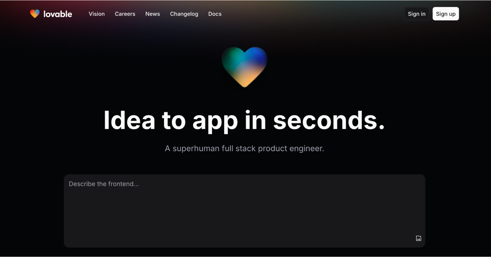

# Mastercard Assistant

A modern, responsive conversational AI assistant that provides financial information and guidance. Built with React, TypeScript, and Shadcn UI components.



## Live Demo

Visit [Mastercard Assistant](https://lovable.dev/projects/58858ca7-e867-44fc-8c78-96fde077a96c) to see the application in action.

## Features

### 1. Conversational Interface
- **Natural Language Processing**: Engage with the assistant using everyday language
- **Context-Aware Responses**: The assistant can maintain context throughout a conversation
- **Animated Message Transitions**: Smooth animations for a polished user experience

### 2. Multi-Modal Input Options
- **Text Input**: Type questions or requests directly
- **Voice Recognition**: Speak queries with extended recording time (up to 2 minutes)
- **File Upload**: Attach documents, images, and other files for analysis

### 3. Rich Output Formats
- **Text Responses**: Clean, formatted text replies
- **Image Support**: Visual responses when appropriate
- **HTML Content**: Structured content with formatted output
- **Table Data**: Structured data displayed in an accessible table format

### 4. Mastercard Brand Integration
- **Brand Colors**: Uses official Mastercard color palette (#EB001B and #1A1F71)
- **Official Logos**: Features the Mastercard logo in the header
- **Wipro Watermark**: Subtle Wipro branding as a watermark

### 5. Responsive Design
- **Mobile-First Approach**: Works seamlessly on devices of all sizes
- **Adaptive Layouts**: UI components adjust based on screen dimensions
- **Touch-Friendly**: Easy to use on touchscreen devices

## Technical Details

### Core Technologies
- **React**: Frontend library for building the user interface
- **TypeScript**: Type-safe JavaScript for improved developer experience
- **Vite**: Modern frontend build tool for fast development and optimized production builds

### UI Framework and Components
- **Tailwind CSS**: Utility-first CSS framework for styling
- **Shadcn UI**: High-quality UI components built with Radix UI and Tailwind CSS
- **Framer Motion**: Animation library for smooth, interactive transitions
- **Lucide Icons**: Consistent, customizable icon system

### State Management and APIs
- **React Hooks**: Custom hooks for state management and business logic
- **Tanstack Query**: Data fetching and caching library
- **API Integration**: RESTful API communication with Spring Boot backend
- **Web Speech API**: Browser-based speech recognition for voice input

### Features in Detail

#### Voice Recognition System
The application uses the Web Speech API for voice input, with these key features:
- Continuous recognition mode for natural conversation
- Extended listening time of 2 minutes
- Auto-stop when speech is not detected after a set period
- Visual feedback during recording with animations
- Real-time transcription of speech to text

#### Message Handling System
Messages are processed through a sophisticated pipeline:
- Unique identifiers for each message
- Role-based styling (user vs assistant)
- Support for various content types (text, images, HTML, tables)
- Timestamp tracking for all interactions
- Custom rendering based on content type

#### Mock Backend Integration
For development and demo purposes, the application includes:
- Mock response generation when backend is unavailable
- Simulated processing delays for realistic UX
- Consistent API interface matching the production backend
- File handling capabilities for document processing

## Getting Started

### Prerequisites
- Node.js (v16+)
- npm or yarn

### Installation

```bash
# Clone the repository
git clone <repository-url>

# Navigate to project directory
cd mastercard-assistant

# Install dependencies
npm install

# Start development server
npm run dev
```

### Building for Production

```bash
# Create optimized production build
npm run build

# Preview production build locally
npm run preview
```

## Project Structure

```
mastercard-assistant/
├── public/                 # Static assets
├── src/
│   ├── components/         # React components
│   │   ├── ui/             # Shadcn UI components
│   │   ├── ChatInterface.tsx   # Main chat interface
│   │   ├── ChatInput.tsx       # Text and voice input
│   │   ├── VoiceInput.tsx      # Speech recognition
│   │   └── ...                 # Other components
│   ├── hooks/              # Custom React hooks
│   ├── services/           # API and external services
│   ├── pages/              # Route-based page components
│   ├── lib/                # Utility functions
│   ├── types/              # TypeScript type definitions
│   └── App.tsx             # Application root
├── tailwind.config.ts      # Tailwind CSS configuration
└── vite.config.ts          # Vite configuration
```

## Demo Notes

When demoing the application, highlight these key features:

1. **Initial Experience**: Show the welcome screen and explain the assistant's capabilities
2. **Text Input**: Demonstrate asking financial questions via text
3. **Voice Input**: Showcase the voice recognition by asking a question verbally
4. **File Upload**: Upload a sample document and show how the assistant processes it
5. **Response Types**: Show different response formats (text, tables, etc.)
6. **Mobile Responsiveness**: Demonstrate how the UI adapts to different screen sizes
7. **Branding Integration**: Point out the Mastercard and Wipro branding elements

## Acknowledgments

- Built with [Lovable](https://lovable.dev)
- Powered by TypeScript, React, and Shadcn UI
- Designed for Mastercard with Wipro's expertise
